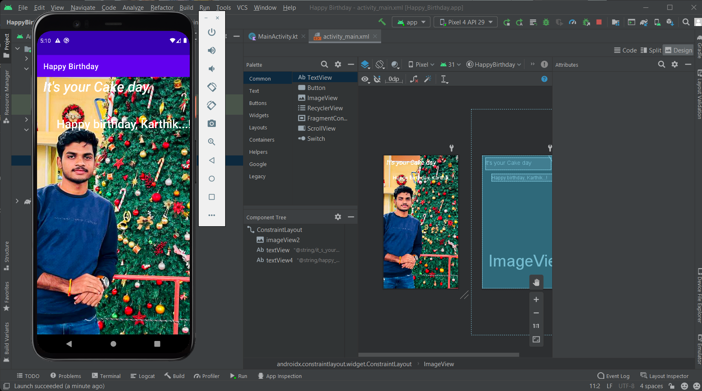

# 📱 Virtual Internship - Android App Development

## 📌 Project: Happy Birthday App
This project is part of the Android Basics with Kotlin course/internship. It is a simple Android application that displays a birthday greeting with text and an image.

## 🎯 Goal
To learn the fundamentals of Android development including:
*   Building UI with Layouts (ConstraintLayout/LinearLayout).
*   Working with TextViews and ImageViews.
*   Understanding the Android project structure and Gradle.

## 📱 App Screenshot
The following output demonstrates the app running on an emulator/device:


## 🛠️ Tech Stack
*   **Language**: Kotlin
*   **Framework**: Android SDK
*   **Build Tool**: Gradle
*   **IDE**: Android Studio

## 📂 Project Structure
```text
Virtual-Internship/
├── HappyBirthday/       # Android Project Root
│   ├── app/             # Application Module
│   │   ├── src/         # Source Code (Kotlin/XML)
│   │   └── ...
│   └── Output.png       # Result Screenshot
└── README.md            # Documentation
```

## 🚀 How to Run
1.  **Open in Android Studio**:
    *   Launch Android Studio -> File -> Open.
    *   Select the `HappyBirthday` folder.
2.  **Sync Gradle**:
    *   Allow Gradle to sync and download dependencies.
3.  **Run**:
    *   Select an emulator or real device.
    *   Click the green "Run" (Play) button.

## 👤 Author
*   **Karthik Kumar Reddy Kota**
